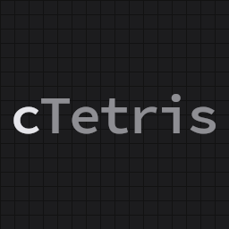
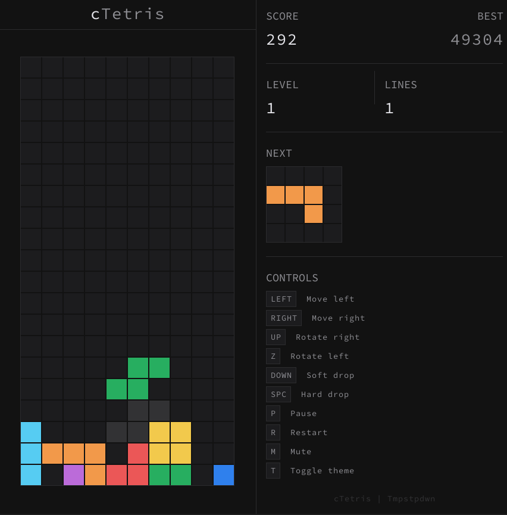
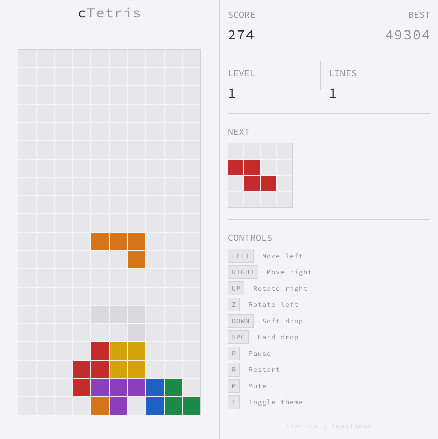

<div align="center">

# cTetris



A minimal, simple tetris implementation written in C using raylib.

<table align="center">
  <tr>
    <td></td>
    <td></td>
  </tr>
</table>
</div>

---

## Game Mechanics

- The grid is 20×10.
- A shape spawns at the top and drops down at an interval determined by the level. Higher levels increase the drop speed, progressively raising difficulty.
- A shape can be moved left/right with input delay, rotated left or right with wall/floor kick collision, soft-dropped for accelerated falling, or hard-dropped for instant locking to where the shape was supposed to fall.
- Once the active shape lands on the grid floor or another shape (when not hard-dropped), a lock timer of 0.5 seconds runs before the piece auto-locks. Further moves resets the lock timer or the drop timer (pause dropping mechanism) depending on whether the shape is grounded or airborne.
- The number of moves since landing is counted against a move budget of 15 which when exhausted, does a forced hard-drop.
- Landing the active shape on a new row resets the move counter to 0 and sets drop mechanism to its default behaviour (no more pausing drop mechanism).
- When a shape locks, it becomes part of the grid.
- If the locked shapes form a complete line, it is cleared and lines above are compacted down.
- A new shape is spawned after the grid settles. This loops until a newly spawned shape collides with a shape already part of the grid, ending the game.
- The objective here is to push the score past the high score, which is determined by the number of lines cleared and how they were cleared.
- High score is saved on to the disk so that its persistent across sessions.


### Controls

| Key       | Action                |
|-----------|-----------------------|
| `LEFT`    | Move left             |
| `RIGHT`   | Move right            |
| `UP`      | Rotate left           |
| `Z`       | Rotate right          |
| `DOWN`    | Soft drop             |
| `SPACE`   | Hard drop             |
| `P`       | Toggle Pause / Resume |
| `R`       | Restart               |
| `M`       | Toggle mute / Unmute  |
| `T`       | Toggle theme          |

### Scoring

| Action                  | Points                              |
|-------------------------|-------------------------------------|
| Soft drop               | 1 per row dropped                   |
| Hard drop               | 2 per row dropped                   |
| 1 line clear            | 100 × level                         |
| 2 line clear            | 300 × level                         |
| 3 line clear            | 500 × level                         |
| 4 line clear            | 800 × level                         |
| Combo bonus             | 50 per successive line clear        |

**Level**: Determined by lines cleared. `Level = (lines / 10) + 1`.

**Combo**: Maintained by clearing lines without breaking the chain. Combo bonus `(combo * 50 * level)` adds on top of line-clear bonus.

---

## Building from Source

### Prerequisites

- **GCC**
- **Make**

### Install (Linux only)

```bash
make install
```

### Uninstall

```bash
make uninstall
```

---

## Releases

Precompiled binaries for Linux and Windows are available on the [Releases](https://github.com/tmpstpdwn/cTetris/releases) page.

---

## Platform Support

cTetris has been tested and verified to work on:

- **Linux**
- **Windows**: 10 and later

---

## Code Documentation

The codebase is extensively documented with comments across all source files. Refer to the source files for detailed technical information.

---

## License

This project is licensed under the [MIT License](LICENSE).
