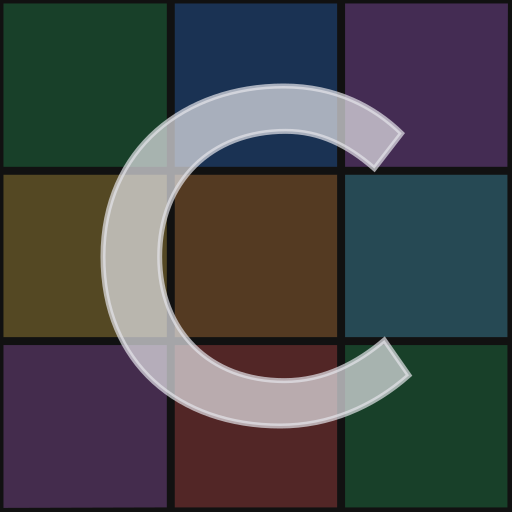
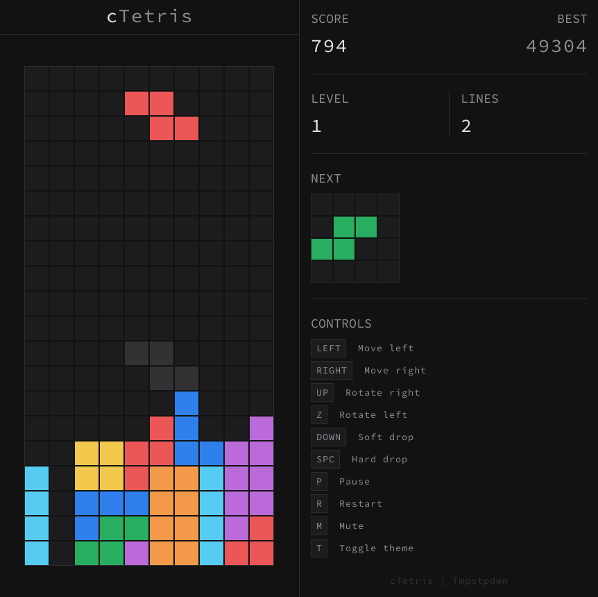
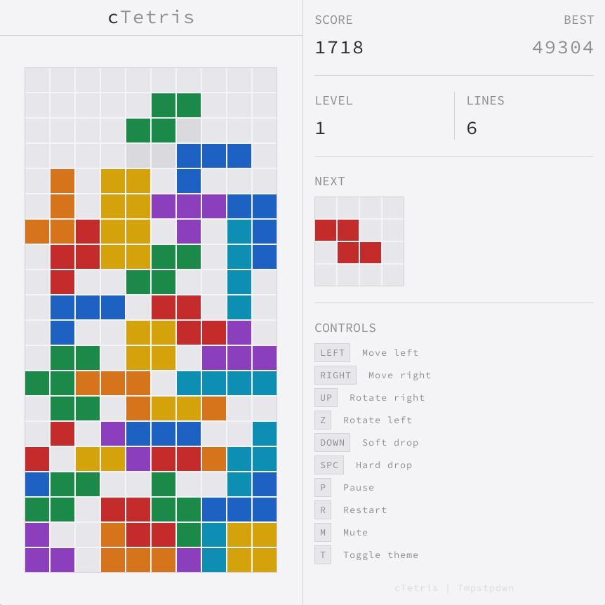

<div align="center">

# cTetris (v1.0.1)



A minimal Tetris implementation written in C and Raylib.

[](https://github.com/siddharthroy12/cTetris/actions/workflows/ci.yml)

<table align="center">
  <tr>
    <td></td>
    <td></td>
  </tr>
</table>
</div>

---

## Game Mechanics

- The grid is 20×10.
- A shape spawns at the top and drops down at an interval determined by the level. Higher levels increase the drop speed, progressively raising difficulty.
- A shape can be moved left/right with input delay, rotated left or right with wall/floor kick collision, soft-dropped for accelerated falling, or hard-dropped for instant locking to where the shape was supposed to fall.
- Once the active shape lands on the grid floor or another shape (when not hard-dropped), a lock timer of 0.5 seconds runs before the piece auto-locks. Further moves resets the lock timer or the drop timer (pause dropping mechanism) depending on whether the shape is grounded or airborne.
- The number of moves since landing is counted against a move budget of 15 which when exhausted, does a forced hard-drop.
- Landing the active shape on a new row resets the move counter to 0 and sets drop mechanism to its default behaviour (no more pausing drop mechanism).
- When a shape locks, it becomes part of the grid.
- If the locked shapes form a complete line, it is cleared and lines above are compacted down.
- A new shape is spawned after the grid settles. This loops until a newly spawned shape collides with a shape already part of the grid, ending the game.
- The objective here is to push the score past the high score, which is determined by the number of lines cleared and how they were cleared.
- High score is saved on to the disk so that its persistent across sessions.


### Controls

| Key       | Action                |
|-----------|-----------------------|
| `LEFT`    | Move left             |
| `RIGHT`   | Move right            |
| `UP`      | Rotate left           |
| `Z`       | Rotate right          |
| `DOWN`    | Soft drop             |
| `SPACE`   | Hard drop             |
| `P`       | Toggle Pause / Resume |
| `R`       | Restart               |
| `M`       | Toggle mute / Unmute  |
| `T`       | Toggle theme          |

### Scoring

| Action                  | Points                              |
|-------------------------|-------------------------------------|
| Soft drop               | 1 per row dropped                   |
| Hard drop               | 2 per row dropped                   |
| 1 line clear            | 100 × level                         |
| 2 line clear            | 300 × level                         |
| 3 line clear            | 500 × level                         |
| 4 line clear            | 800 × level                         |
| Combo bonus             | combo × 50 × level                  |

**Level**: Determined by lines cleared. `Level = (lines / 10) + 1`.

**Combo**: Maintained by clearing lines without breaking the chain. Combo bonus adds on top of line-clear bonus.

---

## Platform Support

cTetris has been tested and verified to work on:

- **Linux** (X11 and Wayland).
- **Windows**: 10 and later.
- **Web** (WebAssembly, via Emscripten) — runs in modern browsers.

### Known issues

- **Wayland (DPI scaling)**: On Wayland compositors that doesn't report DPI scale factor information to raylib, the window may not scale properly.

---

## Releases

### Linux

**Install**

Download the archive for Linux from the [Releases](https://github.com/tmpstpdwn/cTetris/releases) page, extract it,
enter the directory and do:

```bash
mkdir -p ~/.local/bin ~/.local/share/icons/hicolor/scalable/apps ~/.local/share/applications
cp cTetris ~/.local/bin/
cp cTetris.svg ~/.local/share/icons/hicolor/scalable/apps/
cp cTetris.desktop ~/.local/share/applications/
```

**Uninstall**

```bash
rm -f ~/.local/bin/cTetris
rm -f ~/.local/share/icons/hicolor/scalable/apps/cTetris.svg
rm -f ~/.local/share/applications/cTetris.desktop
```

**Note:** Ensure `~/.local/bin` is in your `PATH`.

### Windows

Download the zip for Windows from the [Releases](https://github.com/tmpstpdwn/cTetris/releases) page, extract it, and run `cTetris.exe`. No installation required.

---

## Building from Source

cTetris uses [raylib](https://www.raylib.com/) as a git submodule, and builds with CMake.

### Prerequisites

- **CMake** (3.11+)
- **GCC** (Native Linux builds)
- **X11 development files** (Native Linux builds)
- **mingw-w64 toolchain** (Cross-compiling Windows builds)
- **Emscripten SDK** (Web builds)

### Clone

raylib is vendored as a submodule, so clone recursively:

```bash
git clone --recurse-submodules https://github.com/tmpstpdwn/cTetris.git
```

If you already cloned without `--recurse-submodules`, fetch it with:

```bash
git submodule update --init
```

### Linux

**Build**

```bash
cmake -B build
cmake --build build -j$(nproc)
```

The resulting binary is at `build/cTetris`.

**Install**

```bash
mkdir -p ~/.local/bin ~/.local/share/icons/hicolor/scalable/apps ~/.local/share/applications
cp build/cTetris ~/.local/bin/
cp cTetris.svg ~/.local/share/icons/hicolor/scalable/apps/
cp cTetris.desktop ~/.local/share/applications/
```

**Uninstall**

```bash
rm -f ~/.local/bin/cTetris
rm -f ~/.local/share/icons/hicolor/scalable/apps/cTetris.svg
rm -f ~/.local/share/applications/cTetris.desktop
```

**Note:** Ensure `~/.local/bin` is in your `PATH`.

### Windows (cross-compile from Linux)

```bash
cmake -B build-windows -DCMAKE_TOOLCHAIN_FILE=cmake/toolchain-mingw64.cmake
cmake --build build-windows -j$(nproc)
```

The resulting binary is at `build-windows/cTetris.exe`.

### Web (WebAssembly, via Emscripten)

Requires the [Emscripten SDK](https://emscripten.org/docs/getting_started/downloads.html)
(`emcc` on your `PATH`). Configure with `emcmake` so raylib is built for the
web platform:

```bash
emcmake cmake -B build-web -DCMAKE_BUILD_TYPE=Release
cmake --build build-web -j$(nproc)
```

This produces `build-web/cTetris.html` (plus `.js` and `.wasm`). Browsers
won't run WebAssembly from `file://`, so serve the directory over HTTP:

```bash
cd build-web && python3 -m http.server 8000
```

Then open <http://localhost:8000/cTetris.html>. The high score is saved in the
browser's `localStorage`.

### Debug builds

```bash
cmake -B build-debug -DCMAKE_BUILD_TYPE=Debug
cmake --build build-debug -j$(nproc)
```

### Quick build & run

`run.sh` configures, builds, and launches the game in one step:

```bash
./run.sh          # Release build
./run.sh --debug  # Debug build
```

---

## Code Documentation

The codebase is documented with comments across all source files. Refer to the source files for detailed technical information.

---

## License

This project is licensed under the [MIT License](LICENSE).
